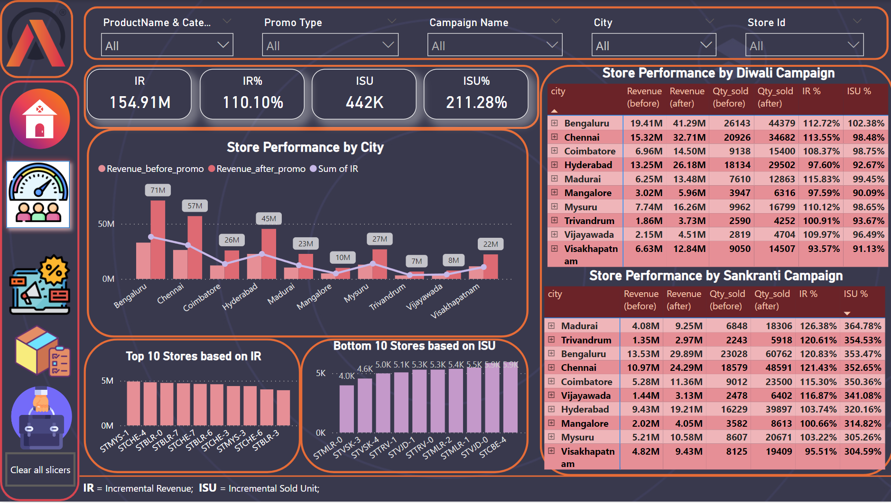

# AtliQ Mart Promotion Analysis
### Project Description
**AtliQ Mart** is a retail giant with over 50 supermarkets in the southern region of India. All their 50 stores ran a massive promotion during the **Diwali 2023** and **Sankranti 2024** (festive time in India) on their AtliQ branded products. Now the sales director wants to understand which promotions did well and which did not so that they can make informed decisions for their next promotional period. 

### Data 
AtliQ Mart Sells 15 products under 5 categories in 50 stores across India.
### Categories
* Grocery & Staples
* Homecare
* Personal care
* Home Appliances
* Combo1

### Promotion Types
To increase sales they introduced 5 different promotions
* 25% off - [original price reduced by 25%]
* 33% off - [original price reduced by 33%]
* 50% off - [Half of original price]
* 500 cashback - [Cash back of 500 Rupees]
* BOGOF - [Buy One Get One Free]

### Measures used
1. #### IR
   Incremental revenue is the additional revenue that a company generates from selling new products or services or from expanding into new market.

2. #### ISU
   Incremental sales are the additional units of a product that companies sell to retailers or consumers because of a sales promotion. 	When a sale is incremental, it's made by a customer who responded to a specific action, campaign or partner.

### Insights
1. Store Performance Analysis

   
2. Promotion Analysis

   

3. Product and Category Analysis

   
4. Business Analysis

   

#### Business Request Queries

    

   
    

   
    

   
    

   
    

## Key Findings

* Based on Revenue, **Diwali Campaign** outperforms Sankranti campaign with 171 Million Revenue.
* The stores in **Bengaluru** generated more revenue. **Visakhapatnam** city generated less revenue.
* **STMYS1(Store in Mysore)** gave excellent Incremental Revenue.
* Promo types **BOGOF & 500 cashback** gave significant sales and revenue growth. Promo type *25% off* had a detrimental impact.
  
   
  
* **Combo1** category provides highest revenue of 127 Million & **Home appliance** category has highest Incremental sold quantity percentage

  

   
   

